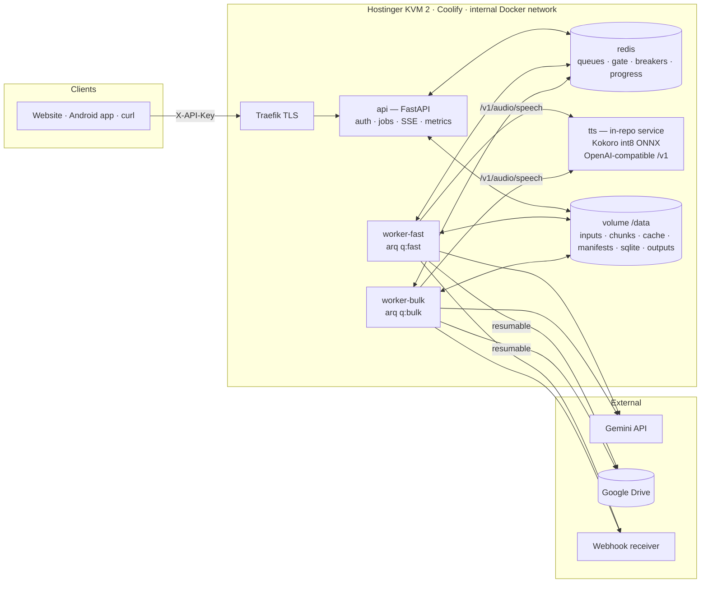

# NARRATOR v2 — Long-Form TTS Narration Platform

**Single-box production architecture · Hostinger KVM 2 (2 vCPU / 8 GB / 100 GB NVMe) · Coolify · Kokoro-82M (int8 ONNX) · Gemini Explainer · Google Drive delivery**

> Single source of truth. Cursor builds exactly this (see `CURSOR_PROMPT.md`). Version 2.0 — supersedes v1. All compute stays on the KVM 2. No external GPUs, no tunnels, no home hardware.

---

## 0. Error philosophy (read before anything else)

"No errors" is not an achievable property of a distributed system on shared infrastructure — networks blip, processes get OOM-killed, tokens expire, disks fill. What a veteran ships instead is a system where **errors are inputs, not incidents**:

1. **Every failure mode is enumerated** (§15) with an automated response designed in advance.
2. **No error can lose work.** The unit of work is a ~60–90 s audio chunk, checkpointed to disk. Kill anything at any moment — worker, TTS, Redis, the whole VPS — and the job resumes from the last chunk.
3. **Every external call retries with the correct policy** for its failure class (§14 retry matrix), behind a circuit breaker so a down dependency pauses work instead of burning it.
4. **Every terminal failure degrades, never destroys**: if Google Drive rejects the upload after 12 hours of synthesis, the audio is served locally and re-upload is one API call — the job never regresses to FAILED because of delivery.

Operator SLO: **zero lost work, zero manual intervention** except two unavoidable human tasks — rotating a revoked Google token and expanding a full disk.

---

## 1. What this system does

| Capability | Detail |
|---|---|
| Input | Raw text, `.txt`, `.md`, `.pdf` — up to **3,000,000 chars** (~1,200 pages) per job |
| Mode `verbatim` | Reads the document as-is (cleanup of page numbers, hyphenation, repeated headers) |
| Mode `explainer` | Gemini map-reduce rewrites the document into a **spoken news-explainer script** in plain layman's language, then narrates it |
| Voice | Kokoro-82M — default `af_heart` (warm, natural US female); weighted blends `af_heart(2)+af_bella(1)` |
| Output | Single loudness-normalized MP3/Opus → **Google Drive**, link via API/SSE/webhook |
| Interface | Authenticated REST (`POST /v1/jobs` → job id → poll / SSE / webhook), public via Coolify domain |
| Modularity | Engine, processor, storage, chunker behind Protocols — model/destination swaps are env changes or one adapter file |

## 2. The physics, stated honestly

1,000 pages ≈ 1.5–3 M chars ≈ **27–54 hours of finished audio** (~155 wpm). On 2 vCPUs there is exactly one lever that changes synthesis speed: the runtime. So we use it:

| Engine path | Realtime factor on 2 vCPU (typ.) | 1,000-page verbatim wall time | 30-min explainer wall time |
|---|---|---|---|
| PyTorch fp32 CPU (stock images) | ~1–2× | 20–50 h | 15–30 min |
| **Kokoro int8 ONNX (this design)** | **~3–5×** | **~7–15 h** | **~7–12 min** (incl. Gemini) |

Every other "speed" gain here is architectural, and they compound: **content-addressed synthesis cache** (repeated text is free — §9), **explainer mode as the sensible default** for huge inputs (100× less audio to make), **compute/I-O overlap** (Gemini prefetch + disk writes ride alongside inference), and **priority lanes** so a 5-minute job never waits behind a 12-hour one (§8). Verbatim marathons remain first-class: checkpointed, preemptible, resumable. Run `scripts/bench.py` after deploy to measure your box's real RTF and auto-tune thread/concurrency settings.

Scale-up later stays inside Hostinger: resize the plan (KVM 4/8 — env changes only) or add a second KVM running extra `worker`+`tts` pointed at this Redis over Hostinger private networking/WireGuard. Nothing in the design assumes hardware you don't rent.

### RAM budget (8 GB)

Coolify+Traefik+your site/app ~2–2.5 G · `tts` (int8 ONNX) ~0.6–1 G · workers ~0.7 G total · api ~0.35 G · redis <0.15 G → **~2.5–3 G headroom**. Hard `mem_limit` on everything (§13); narrator containers get low `cpu_shares` so your website always wins CPU contention.

---

## 3. Topology



Only `api` gets a domain. `tts`, `redis`, workers: internal network, no published ports.

## 4. Services

| Service | Source | RAM cap | Role |
|---|---|---|---|
| `api` | `docker/api.Dockerfile` | 512 M | Auth, ingest-to-disk, job CRUD, SSE, `/metrics`, `/healthz` |
| `worker-fast` | `docker/worker.Dockerfile` (`QUEUE=fast`) | 384 M | Small jobs (< ~20 min audio) — never blocked by bulk |
| `worker-bulk` | same image (`QUEUE=bulk`) | 640 M | Marathon jobs — yields to fast lane at chunk boundaries |
| `tts` | **`services/tts/` (in-repo)** — FastAPI + `kokoro-onnx`, `kokoro-v1.0.int8.onnx` + `voices-v1.0.bin` | 1024 M | OpenAI-compatible `/v1/audio/speech`, `/v1/audio/voices`, `/health`, `/stats` (live RTF) |
| `redis` | `redis:7-alpine`, AOF, `noeviction` | 192 M | arq queues, synth gate, breakers, live state, pub/sub, idempotency |

Durable ledger: **SQLite (WAL)** on `/data` — jobs, kv (folder ids), cache index. Redis = live; SQLite = truth.

### Why an in-repo TTS service instead of a prebuilt image
int8 ONNX is ~2–3× faster and ~½ the RAM of the stock fp32 PyTorch CPU path — on a 2-vCPU box that's the whole ballgame — and owning the service gives us thread pinning (`intra_op=2, inter_op=1, sequential`), a **warmup gate** (healthcheck reports ready only after a real synthesis completes, killing cold-start timeouts), a live realtime-factor gauge, and voice-vector blending. The HTTP contract is standard OpenAI speech, so any compatible server remains a drop-in via `TTS_BASE_URL` if you ever change models. Model files (~120 MB) download to the `tts-models` volume on first start with sha256 verification.

---

## 5. Core abstractions — the modularity contract

Pipeline code imports **only** these Protocols (`core/protocols.py`); concrete classes are chosen in `core/factory.py` from config:

```python
class ContentProcessor(Protocol):
    async def process(self, doc: Document, ctx: JobContext) -> NarrationScript: ...

class TTSEngine(Protocol):
    async def synthesize(self, text: str, *, voice: str, speed: float,
                         response_format: str = "wav") -> SynthesisResult: ...
    async def list_voices(self) -> list[str]: ...
    async def health(self) -> bool: ...

class StorageBackend(Protocol):
    async def upload(self, local_path: str, *, filename: str,
                     mime_type: str, meta: dict) -> StoredFile: ...

class Chunker(Protocol):
    def split(self, script: NarrationScript) -> list[Chunk]: ...
```

Shipped: `VerbatimProcessor` / `GeminiExplainerProcessor` · `OpenAICompatEngine` · `GoogleDriveStorage` / `LocalStorage` · `SentenceChunker`. Your future logic (glossaries, translation-first, dialogue voices, S3) = one new class + one factory line.

## 6. Job lifecycle & state machine

```
QUEUED → PREPROCESSING → SYNTHESIZING → ASSEMBLING → UPLOADING → COMPLETED
                                   │            │          └─(delivery fails terminally)→ UPLOAD_PENDING ─retry→ UPLOADING
                                   └──────┴──── FAILED (resumable via POST /retry) · CANCELLED
```

- `UPLOAD_PENDING` = audio is **done and downloadable from the API**; only Drive delivery is outstanding. A cron retries it every 30 min; `POST /v1/jobs/{id}/retry-upload` forces it. Synthesis work is never hostage to delivery.
- Transitions: SQLite (durable) + Redis mirror + pub/sub `job:{id}:events` (drives SSE). Status carries `stall_reason` when a circuit breaker has paused work (§14) — the job isn't failing, it's waiting.

### Per-job filesystem (volume `/data`)

```
/data/jobs/{id}/  input.raw  input.txt  script.json  manifest.json
                  chunks/000001.wav …   concat.txt   final.mp3
/data/cache/tts/{aa}/{sha256}.wav        # global synthesis cache (§9)
/data/silence/p200.wav p400.wav p600.wav p900.wav   # generated once, global
/data/outputs/{id}.mp3                   # LocalStorage / UPLOAD_PENDING copies
/data/ledger.db                          # SQLite (WAL)
```

### `manifest.json` — the resumability contract (frozen schema)

```json
{"job_id":"jb_…","engine":{"base_url":"http://tts:8880/v1","model":"kokoro-int8","voice":"af_heart","speed":1.0},
 "chunks":[{"idx":1,"sha256":"…","chars":1142,"status":"done","file":"chunks/000001.wav","ms":68240,"attempts":1,"cache_hit":false},
           {"idx":2,"sha256":"…","chars":1098,"status":"pending","attempts":0}],
 "created_at":"…","updated_at":"…"}
```

Atomic writes only (`.tmp` + `os.replace`). **Resume rule:** skip chunks with `status=="done"` whose wav exists, has a valid RIFF header, and size > 1 KB (a truncated wav from a crash is detected and re-synthesized — sha256 guards against text drift). Cancel flag checked between chunks and stages.

## 7. API contract (`api` service)

Auth `X-API-Key` (constant-time, multi-key). Submit rate limit 10/min/key. Traefik + app both cap body at 50 MB.

| Endpoint | Purpose |
|---|---|
| `POST /v1/jobs` | Multipart `file` (txt/md/pdf) or `text` + `params` JSON. Streams to `/data/jobs/{id}/input.raw` in 1 MB blocks (client disconnect mid-upload ⇒ temp discarded, nothing enqueued). Preflight: size/ext/char caps, **disk estimate**, `MAX_ACTIVE_JOBS` (429 + Retry-After), `Idempotency-Key` (SETNX 24 h). Routes to `q:fast` or `q:bulk` by estimated audio minutes. → `202 {job_id, lane}` |
| `GET /v1/jobs/{id}` | stage, %/chunks, ETA, `stall_reason`, warnings, result `{drive_file_id, web_view_link, duration_seconds, size_bytes}` |
| `GET /v1/jobs/{id}/events` | SSE (Redis pub/sub bridge, 15 s heartbeat, closes on terminal) |
| `GET /v1/jobs/{id}/download` | Streams local artifact (LocalStorage or `UPLOAD_PENDING`) |
| `POST /v1/jobs/{id}/cancel` · `POST /v1/jobs/{id}/retry` · `POST /v1/jobs/{id}/retry-upload` | Cancel · re-enqueue a FAILED job (resumes manifest) · force delivery retry |
| `GET /v1/jobs` · `GET /v1/voices` · `GET /healthz` · `GET /metrics` | Ledger list · engine voices (10-min cache) · redis+tts+disk liveness · Prometheus (jobs_by_state, queue_depth per lane, chunk_seconds histogram, realtime_factor, cache_hit_ratio, breaker_state) |

**`params`:** `{"mode":"explainer"|"verbatim","voice":"af_heart","speed":1.0,"title":"…","output_format":"mp3"|"opus","explainer_style":"news"|"teacher"|"podcast","target_language":"en","webhook_url":null,"drive_folder_id":null}` — validated by Pydantic (speed 0.5–2.0 etc.).

## 8. Scheduling — priority lanes with cooperative preemption

The classic single-box failure: a 12-hour job makes the service unusable for everyone else. Fix, enabled by chunk-granular work:

- **Routing:** estimated audio minutes = script chars ÷ 900. ≤ `FAST_LANE_MAX_MINUTES` (20) → `q:fast`, else `q:bulk`. One arq worker per lane, `max_jobs=1` each.
- **Synth gate (Redis):** exactly **one** synthesis stream owns the CPU at a time. Before *each chunk*, `worker-bulk` checks `synth:fast_pending`; if a fast job is waiting/running, bulk parks (state event `stall_reason:"yielding_to_fast_lane"`) until the fast lane drains. Fast jobs therefore start within ≤ one chunk (~60–90 s) even mid-marathon; the marathon resumes exactly where it paused — preemption costs nothing because every chunk is a checkpoint.
- Explainer **preprocessing is network-bound** and exempt from the gate — a bulk job's Gemini phase overlaps a fast job's synthesis for free parallelism.
- Both workers: `cpu_shares` below your website's containers, so narrator load never degrades your public site.

## 9. Synthesis stage (with content-addressed cache)

Per chunk, in order:
1. **Sanitizer** (§15-I): strip control chars, collapse `>3` repeated chars, replace URLs/emails → "link"/"email address", break >40-char unbroken tokens, drop emoji; if non-Latin ratio > 30 % apply `NON_ENGLISH_POLICY` (`skip_warn` default | `read_anyway`); empty-after-sanitize ⇒ 200 ms silence + warning, **not** an error.
2. **Cache check:** key = `sha256(engine_model | voice | speed | sanitized_text)` → `/data/cache/tts/{k[:2]}/{k}.wav`. Hit ⇒ hard-link into `chunks/`, mark `cache_hit`, skip inference (re-runs, retried jobs, boilerplate, overlapping docs become free). SQLite `cache_index(key,size,last_used)`; hourly LRU eviction to `CACHE_MAX_GB=5`.
3. **Synthesize:** `POST {TTS_BASE_URL}/audio/speech` (shared `httpx.AsyncClient`, `timeout=300`), `SYNTH_CONCURRENCY=2` semaphore (one request phonemizes/writes while the other infers — measured, not guessed: `bench.py`). Tenacity retry per §14; wrapped in the **TTS circuit breaker**.
4. **Persist:** wav → `chunks/{idx:06d}.wav` (direct to disk, never accumulated in RAM) → cache store → atomic manifest update → Redis progress INCR → event. Rolling ETA = mean of last 50 chunk times × remaining.
5. **Failed-chunk policy:** 6 attempts exhausted ⇒ `status:"failed"`; if failed > `MAX_FAILED_CHUNK_PCT` (1 %) ⇒ job FAILED (resumable), else 300 ms silence placeholder + warning — one poisoned chunk never kills a 12-hour job.

## 10. Assembly & 11. Delivery

**Assembly (`pipeline/assemble.py`)** — ffmpeg subprocess only (no audio in RAM): validate every chunk wav (RIFF header + size; corrupt ⇒ one re-synthesis, then error) → `concat.txt` interleaving chunks + global silence files → single pass
`ffmpeg -f concat -safe 0 -i concat.txt -af loudnorm=I=-16:TP=-1.5:LRA=11 -ar 24000 -ac 1 -c:a libmp3lame -b:a 64k -id3v2_version 3 -metadata title="{title}" final.mp3` (opus: `-c:a libopus -b:a 32k`) → `ffprobe` duration/size. ffmpeg runs in its own process group; on cancel/shutdown the group is killed (no zombies). 64 kbps mono ≈ 28 MB/hour ⇒ 40 h ≈ 1.1 GB.

**Delivery (`storage/gdrive.py`)** — OAuth **refresh token**, never a service account (SAs upload into their own invisible 15 GB quota; files won't appear in your My Drive). One-time bootstrap via `scripts/gdrive_auth.py` (Desktop OAuth client, scope `drive.file`, consent screen **published to Production** or the token dies in 7 days). App creates `Narrator/YYYY-MM/` folders (ids cached in SQLite). Upload = `MediaFileUpload(resumable=True, chunksize=8 MB)` loop with progress events, in `asyncio.to_thread`. Terminal delivery failures (revoked token, quota full) ⇒ `UPLOAD_PENDING` fallback (§6), never job loss. On success: `drive_file_id` + links stored; chunks deleted; manifest/script kept `RETENTION_DAYS=7`.

## 12. The TTS service (`services/tts/`)

- FastAPI, one ONNX `InferenceSession` (`kokoro-v1.0.int8.onnx` + `voices-v1.0.bin`, downloaded to volume on first start, sha256-verified), `espeak-ng` installed for phonemization.
- Session options: `intra_op_num_threads=ONNX_INTRA_OP(2)`, `inter_op=1`, sequential execution, full graph optimization; internal semaphore serializes inference (concurrency lives at the worker/pipeline level).
- **Warmup:** synthesizes a sentence at startup; `/health` returns `ready:true` only after — Coolify healthcheck (`start_period 90 s`) therefore guarantees no cold-start request timeouts, ever.
- Endpoints: `POST /v1/audio/speech` (`{model,input,voice,speed,response_format:"wav"}`; 400 with machine-readable `reason` on unspeakable input), `GET /v1/audio/voices`, `GET /health`, `GET /stats` (rolling RTF, inference count).
- **Voice blending:** parse `name(w)+name(w)`, weighted-average the style vectors, synthesize with the custom vector. (Consult the installed `kokoro_onnx` API for the exact call signature at build time — treat the installed package as source of truth.)

## 13. Compose (Coolify Docker-Compose resource)

```yaml
services:
  api:
    build: {context: ., dockerfile: docker/api.Dockerfile}
    environment: [REDIS_URL=redis://redis:6379/0, TTS_BASE_URL=http://tts:8880/v1, DATA_DIR=/data,
      API_KEYS=${API_KEYS}, STORAGE_BACKEND=${STORAGE_BACKEND:-gdrive},
      GDRIVE_CLIENT_ID=${GDRIVE_CLIENT_ID}, GDRIVE_CLIENT_SECRET=${GDRIVE_CLIENT_SECRET},
      GDRIVE_REFRESH_TOKEN=${GDRIVE_REFRESH_TOKEN}, GEMINI_API_KEY=${GEMINI_API_KEY},
      GEMINI_MODEL=${GEMINI_MODEL:-gemini-2.5-flash}]
    volumes: ["narrator-data:/data"]
    depends_on: [redis]
    mem_limit: 512m
    healthcheck: {test: ["CMD","curl","-fsS","http://localhost:8000/healthz"], interval: 30s, timeout: 10s, retries: 3, start_period: 20s}

  worker-fast:
    build: {context: ., dockerfile: docker/worker.Dockerfile}
    environment: [QUEUE=fast, SYNTH_CONCURRENCY=${SYNTH_CONCURRENCY:-2}]  # + same base block as api
    volumes: ["narrator-data:/data"]
    depends_on: [redis, tts]
    mem_limit: 384m
    cpu_shares: 256
    stop_grace_period: 150s
    restart: unless-stopped

  worker-bulk:
    build: {context: ., dockerfile: docker/worker.Dockerfile}
    environment: [QUEUE=bulk, SYNTH_CONCURRENCY=${SYNTH_CONCURRENCY:-2}]  # + same base block
    volumes: ["narrator-data:/data"]
    depends_on: [redis, tts]
    mem_limit: 640m
    cpu_shares: 256
    stop_grace_period: 150s
    restart: unless-stopped

  tts:
    build: {context: ., dockerfile: services/tts/Dockerfile}
    environment: [ONNX_INTRA_OP=${ONNX_INTRA_OP:-2}]
    volumes: ["tts-models:/models"]
    mem_limit: 1024m
    cpus: "2.0"
    cpu_shares: 512
    restart: unless-stopped
    healthcheck: {test: ["CMD","curl","-fsS","http://localhost:8880/health"], interval: 30s, timeout: 10s, retries: 5, start_period: 90s}

  redis:
    image: redis:7-alpine
    command: ["redis-server","--appendonly","yes","--maxmemory","128mb","--maxmemory-policy","noeviction"]
    volumes: ["redis-data:/data"]
    mem_limit: 192m
    restart: unless-stopped

volumes: {narrator-data: {}, tts-models: {}, redis-data: {}}
```

Coolify: one Docker-Compose resource from the Git repo; domain on `api` only; secrets in the env tab; persistent named volumes; deploy webhook for push-to-deploy. **Graceful deploys:** workers trap SIGTERM → finish/abort the current chunk cleanly, flush manifest, re-enqueue their job, exit within `stop_grace_period` → the new deploy resumes mid-manifest. Zero work lost across releases.

## 14. Resilience core — retry matrix & circuit breakers

Retries are **layered with idempotency at every layer**: call-level (tenacity) → chunk-level (manifest attempts) → stage-level → job-level (arq `max_tries=3`, resumes via manifest) → operator-level (`/retry`, `/retry-upload`). Cache + manifest make every retry safe to repeat.

| Dependency | Retry (backoff + jitter, then breaker) | **Do not retry** → automated response |
|---|---|---|
| TTS | timeout, conn-reset, 5xx, 429 — 6×, 1→60 s | 400 unspeakable ⇒ aggressive re-sanitize once ⇒ silence-placeholder policy |
| Gemini | 429 (honor `retry-after`), 500/503, timeout, truncated/invalid JSON (repair, then one re-ask) — 5× per **section** | safety-block ⇒ that section falls back to verbatim + job warning; 400 ⇒ fail section, continue map |
| Google Drive | 403 `userRateLimitExceeded`, 429, 5xx, resumable-chunk errors — 8× | 401 `invalid_grant` / 403 `storageQuotaExceeded` ⇒ **UPLOAD_PENDING** + alert log (human rotates token / clears quota; audio already safe & downloadable) |
| Redis | connection errors — infinite backoff at process level (arq native) | `noeviction` + AOF prevent silent state loss; startup `reconcile()` re-enqueues orphans from SQLite |
| ffmpeg | corrupt chunk ⇒ validate + re-synthesize once | other non-zero exit ⇒ FAILED with captured stderr (resumable; chunks intact) |
| Webhook | 3× | signed (HMAC-SHA256), failures logged, never affect job state |

**Circuit breakers** (`core/breaker.py`, Redis-backed, shared across workers) per dependency: open after 5 consecutive retry-exhausted failures → pause work (job stays SYNTHESIZING with `stall_reason`) → half-open single probe after 60 s (cap 10 min) → close on success. A 20-minute TTS outage costs 20 minutes, not thousands of wasted retry cycles or a failed job.

---

## 15. Failure catalog — where, when, and what breaks (and the built-in answer)

**A · Memory / compute**
| Failure | When it hits | Symptom | Built-in response |
|---|---|---|---|
| Container OOM-kill | Big job + tight box | Container restarts, exit 137 | `mem_limit` scopes blast radius; streaming rules mean no stage needs > ~150 MB; worker restart resumes manifest automatically |
| TTS memory creep | Long uptimes | RSS grows | Single session, no per-request allocations retained; `/stats` RSS gauge; `restart: unless-stopped` makes even a kill self-heal |
| CPU starvation of your website | Marathon synthesis | Site latency | `cpu_shares` weighting (narrator = 256 vs default 1024) + single-stream synth gate |
| CPU steal on VPS | Host contention | RTF drops | `realtime_factor` gauge exposes it; ETA recalculates from rolling actuals, not assumptions |

**B · Disk**
| Full disk mid-job | Chunks ~173 MB/audio-hour + cache | writes fail | Submit-time preflight (est = chars × 2.4 KB + 5 GB reserve ⇒ 507 reject) · mid-run guard (< 2 GB ⇒ graceful pause, resumable) · cache LRU cap · hourly purge of finished-job chunks · `RETENTION_DAYS` sweep |
| Truncated wav after crash | Kill during chunk write | Corrupt concat | Resume validation (RIFF + size) re-synthesizes the partial chunk |
| SQLite lock/corruption | Concurrent writers, power loss | `database is locked` | WAL mode, single-writer discipline via `state.py`, `busy_timeout`; nightly ledger+manifests tarball uploaded to Drive (system backs up its own brain) |

**C · TTS service**
| Cold start timeout | First request after deploy | 504s | Warmup gate — not ready until a real synthesis succeeded |
| Hung inference | Rare ORT stall | Request never returns | httpx 300 s timeout ⇒ retry ⇒ breaker; container healthcheck restarts a wedged service |
| Model download fails/corrupt | First boot, registry blip | Startup crash-loop | Download-with-resume + sha256 verify + retry; models persist in `tts-models` volume so it's once-ever |
| Unspeakable chunk (symbols, tables, base64, emoji) | Real-world PDFs | 400 / empty audio | Sanitizer (§9-1) + machine-readable 400 ⇒ one aggressive re-clean ⇒ silence-placeholder + warning |
| Non-English blocks (Hebrew/Chinese in an "English" doc) | Mixed documents | Gibberish audio | Script-ratio detector ⇒ `NON_ENGLISH_POLICY` skip+warn (default) or read-anyway |

**D · Gemini (explainer)**
Rate limits (429 storms) → per-section backoff honoring `retry-after` + breaker · malformed/truncated JSON → strict schema, repair pass, one re-ask · **hallucinated numbers/names** → grounding validator (every number/proper-noun must exist in source pool) with one regeneration then `warnings[]` · safety blocks on legitimate content → section-level verbatim fallback · model deprecation → `GEMINI_MODEL` env swap, nothing else.

**E · Google Drive**
`invalid_grant` (token revoked / consent app left in Testing ⇒ 7-day expiry) → UPLOAD_PENDING + documented rotation (rerun auth script, paste new token) · quota exhausted → UPLOAD_PENDING, audio downloadable meanwhile · rate limits/5xx → resumable retries · duplicate files after retried upload → upload keyed by `{job_id}` filename, pre-check by name in target folder ⇒ idempotent.

**F · Queue & state**
Redis restart → AOF replay + arq redelivery + `reconcile()`; manifests make redelivery idempotent · orphaned "running" job after hard crash → startup reconcile re-enqueues · duplicate submits (mobile double-tap, client retry) → `Idempotency-Key` SETNX returns the same job · poison job crash-looping a worker → arq `max_tries=3` ⇒ FAILED with error, worker lives on.

**G · Network & API edge**
Client disconnect mid-upload → temp file discarded, nothing enqueued · mid-SSE → server detects, closes cleanly (15 s heartbeats) · slow-loris / oversize bodies → Traefik + app limits, uvicorn timeouts · burst submits → 10/min/key sliding window + `MAX_ACTIVE_JOBS` 429 with `Retry-After`.

**H · Deploys & ops**
Deploy mid-marathon → SIGTERM graceful chunk-boundary shutdown ⇒ auto-resume on new version · env typo (bad `TTS_BASE_URL`, missing key) → fail-fast config validation at boot with explicit message; healthcheck stays red so Coolify keeps the previous version serving · log flood on long jobs → structured JSON, per-chunk logs at DEBUG, INFO is per-stage; rely on Docker/Coolify rotation · clock skew → all timestamps UTC from one source.

**I · Input pathologies (the ones that only show up in production)**
Scanned PDF with no text layer → char count ≈ 0 ⇒ immediate 422 "needs OCR" (we don't OCR on 2 vCPUs) · encrypted PDF → 422 with reason · wrong encoding txt → UTF-8 with detection fallback, replacement-char ratio > 5 % ⇒ warning · pathological whitespace/control chars → normalizer · single 6,000-char "sentence" (legal text) → clause-splitting at `; : , —` · numbers/currency/dates read weirdly → verbalization rules in processors + engine normalization · 3 MB of repeated boilerplate → synthesis cache turns it into one inference.

---

## 16. Observability

`structlog` JSON everywhere (`job_id`, `stage`, `chunk_idx`) → Coolify log view · `/metrics` Prometheus: `jobs_by_state`, `queue_depth{lane}`, `chunk_seconds` histogram, `realtime_factor`, `cache_hit_ratio`, `breaker_state{dep}`, `disk_free_bytes` · SSE per-job event stream for UIs · `scripts/bench.py` measures the box's true RTF across `{ONNX_INTRA_OP × SYNTH_CONCURRENCY}` and prints the winning env values — run once after first deploy, and after any plan resize.

## 17. Security

API-key auth (constant-time) · TLS via Coolify/Traefik · `tts`/`redis`/workers unreachable from the internet · secrets only in Coolify env (`.env.example` documents shape) · Drive scope `drive.file` only · upload allow-list + size caps, inputs are parsed as text, never executed · HMAC-signed webhooks.

## 18. Configuration reference

| Env | Default | | Env | Default |
|---|---|---|---|---|
| `API_KEYS` | — required | | `PROCESSOR_DEFAULT` | `explainer` |
| `TTS_BASE_URL` | `http://tts:8880/v1` | | `EXPLAINER_TARGET_MINUTES` | `30` |
| `TTS_VOICE` / `TTS_SPEED` | `af_heart` / `1.0` | | `GEMINI_API_KEY` / `GEMINI_MODEL` | — / `gemini-2.5-flash` |
| `SYNTH_CONCURRENCY` | `2` | | `STORAGE_BACKEND` | `local` dev / `gdrive` prod |
| `ONNX_INTRA_OP` | `2` | | `GDRIVE_CLIENT_ID/SECRET/REFRESH_TOKEN` | — |
| `CHUNK_TARGET_CHARS` / `CHUNK_HARD_MAX` | `1200` / `2000` | | `GDRIVE_ROOT_FOLDER_NAME` | `Narrator` |
| `FAST_LANE_MAX_MINUTES` | `20` | | `MAX_INPUT_CHARS` / `MAX_ACTIVE_JOBS` | `3000000` / `2` |
| `CACHE_MAX_GB` | `5` | | `MAX_FAILED_CHUNK_PCT` | `1` |
| `NON_ENGLISH_POLICY` | `skip_warn` | | `RETENTION_DAYS` / `WEBHOOK_SECRET` | `7` / optional |

## 19. Repository layout

```
narrator/
├── ARCHITECTURE.md · CURSOR_PROMPT.md · .cursor/rules/narrator.mdc
├── pyproject.toml (uv) · docker-compose.yml · docker-compose.dev.yml
├── docker/{api.Dockerfile, worker.Dockerfile}
├── services/tts/            # in-repo engine: main.py · engine.py · blend.py · download_models.py · Dockerfile
├── src/narrator/
│   ├── core/     config.py · models.py · protocols.py · factory.py · state.py · breaker.py · gate.py · retry.py · cache.py · logging.py · events.py
│   ├── api/      main.py · deps.py · routes/{jobs,voices,health,metrics}.py
│   ├── worker/   main.py (arq per-lane) · tasks.py (run_job · retry_uploads · cleanup) · shutdown.py
│   ├── pipeline/ ingest.py · chunker.py · sanitize.py · synth.py · assemble.py · deliver.py
│   ├── processors/ verbatim.py · explainer.py · prompts.py
│   ├── engines/  openai_compat.py
│   └── storage/  gdrive.py · local.py
├── scripts/ gdrive_auth.py · bench.py · smoke_test.sh · chaos/ (fault-injection helpers) · sample.txt
└── tests/  unit/ · integration/ · chaos/
```

## 20. Where you plug in future logic (by design)

New narration style → preset in `processors/prompts.py` · new model → `TTS_BASE_URL`/engine adapter · new destination → one `StorageBackend` · pre-TTS transforms (glossary, translate-first — your Maestro pattern) → a `ContentProcessor` composed before chunking · multi-voice dialogue → `Segment.voice` field, chunker already threads segment metadata through.
